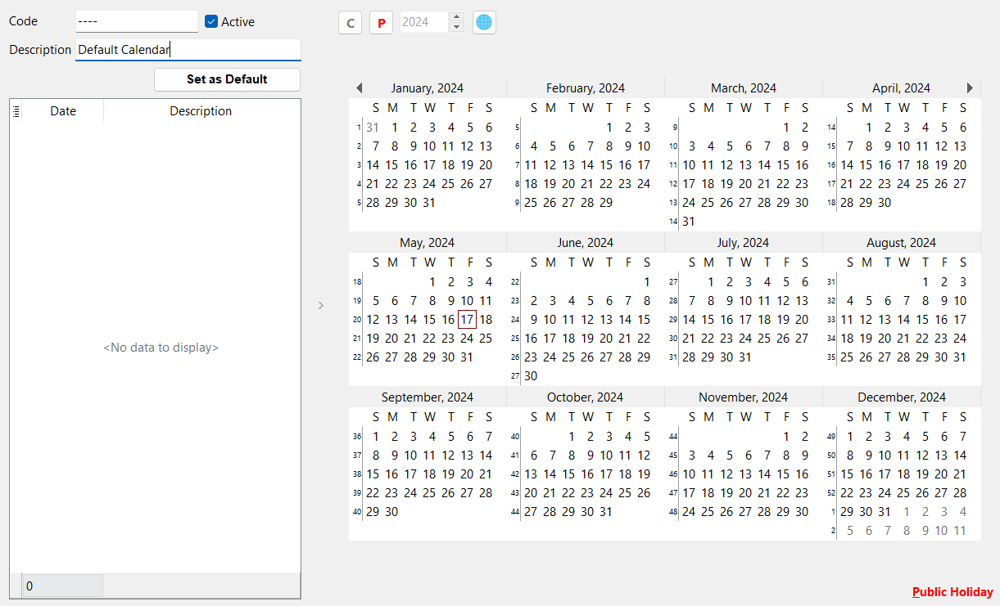
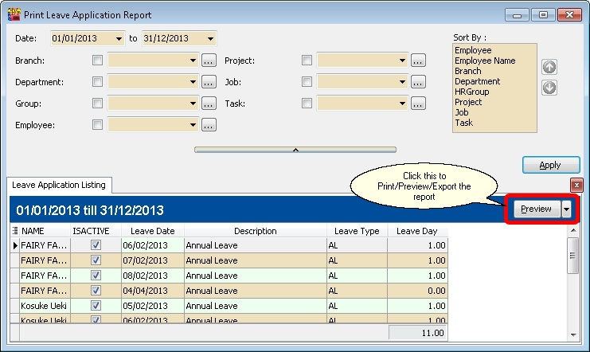
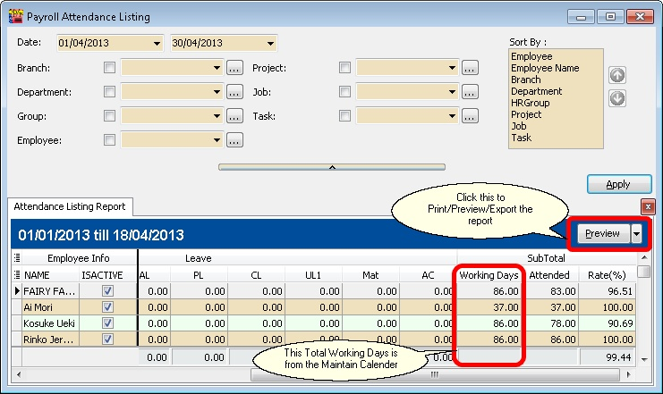
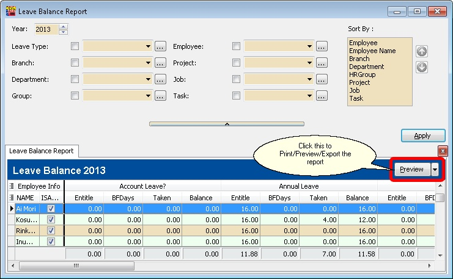
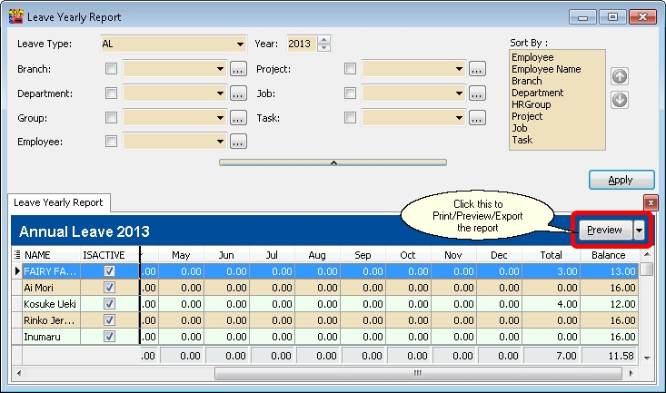

## Introduction

Leave module is used to monitor the employee leaves, company calendar and printing the attendance reports. It consists of 4 sections:

1. **Maintenance**
2. **Leave Entitlement Processor**
3. **Leave Application**
4. **Reports**

## Maintain Leave Type

Maintain leave type define the leave type, like annual leave, medical leave, maternity, unpaid leave, etc. You also can define the leave type setting whether:

- Is Entitle
- Is Unpaid
- Brought Forward

:::info
Before assigning leave group to your employee, you need to make sure that you have leave type and leave group maintained beforehand. **Leave Type** simply means the nature of the leave, while **Leave Group** is the grouping method of employee according to their leave entitlement.
:::

1. Firstly, point to **Leave** tab and select **Maintain Leave Type**

   

2. Click on **New** button on the upper right corner to create new leave type

   

3. Assign code for your leave type.

   :::tip Example
   MaL for Maternity Leave:

   - Tick on the relevant pay entitlement
   - Click "Save"
     :::

   

4. You have your new leave type created.

   

## Maintain Leave Group

:::info Features

- Allow to customise your leave policies for different level of people in company.
- You can customise the scripts (under **Tools** > **Maintain Script**) and set in the leave group.

:::

1. Firstly, point to **Leave** tab and select **Maintain Leave Group**

   

2. Click on **New** button on the upper right corner to create new leave group.

   

3. Assign code for your new leave group.

   :::tip Example
   FW for Foreign Worker

   Click on the ➕ button to select the entitled leave type for this particular leave group.
   :::

   

4. Taking **Annual Leave (AL)** as an example.

   - By default, the calculation for “Annual Leave” is as such:

   | Year of Service (Years) | Day of Leave Entitled (Days) |
   | ----------------------- | ---------------------------- |
   | 1 to 2                  | 8                            |
   | 3 to 4                  | 12                           |
   | >4                      | 16                           |

   

   If your company’s annual leave policy follows this default setting, you can point to the **Entitle** tab and select **Annual Leave Entitlement Policy**. With that, the calculation will follow the default setting.

   

   Click **Save**.

5. If your company does not follow the default annual leave setting, you can always customise your own calculation by clicking on **Edit**, and then the 3 dots beside the **entitle** column

   

6. For example, your company complies to the calculation as below.

   | Year of Service (Years) | Day of Leave Entitled (Days) |
   | ----------------------- | ---------------------------- |
   | 1 to 2                  | 8                            |
   | 3 to 5                  | 12                           |
   | >5                      | 18                           |

   Thus, you need to key in the table as such:

   | Year From | Year To | Days |
   | --------- | ------- | ---- |
   | 1         | 2       | 8    |
   | 3         | 5       | 12   |
   | 1         | 99      | 18   |

   

7. Click **OK** and you are done 🥳

## Maintain Public Holiday

**Step 1:** Leave | Maintain Public Holiday Calendar… | Select a Public Holiday Calendar / Create New  
    
    

**Step 2: Set public holidays**  
User may import default Malaysia public holiday calendar or set manually  

Option 1: Global Icon | Select a State | OK  
    
    

:::info
User may check or uncheck the dates
:::

Option 2: Click on ***'P' button*** | Select date
    

**Step 3:** Save  

## Employee Leave Group Assignment

1. Firstly, point to **Human Resource** tab and select **Maintain Employee**

   

2. Select relevant employee. eg: Nicole. Click **Edit**

   

3. Click on **Grouping** tab, and you will see **Leave Group** at the last panel.

   

4. Assign relevant leave group.

   :::tip Example
   Foreign Worker (FW)
   Click **Save** afterwards
   :::

   
   

## Leave Application

:::info Features

- **Recording the leave apply by each employee. You can input any type of leaves you defined in Maintain Leave Type.**
- **You can set the calendar into individual employee in Maintain Employee. It will loaded the employee leave aplication.**
- It able to monitor the leave apply based on the up-to-date number of leaves entitlement.

  For example,
  1. **Annual Leave Entitlement = 12 days**
  2. **Average Annual Leave Entitlement = 1 day per month**
  3. **Annual Leave applied for a month**
      - **January = 0 day**
      - **February = 1 day**
      - **March = 0 day**

  From the above scenario, total annual leaves entitled up to month of April are 4 days (including month of April).

  It means number of annual leaves remaining are (4 – 1 ) = 3 days.

  If the employee apply 4 days leave in month of April, the system will prompt the below warning. “You’ve taken 5.0 days of Annual Leave, but Annual Leave limit for April is 4.0 days.”

  So, you can choose to Allow, Not Allow or Unpaid Leave.
  :::

1. First, point to **Leave** and click on **Leave Application**

   

2. Select the year. eg: Year 2015

   

3. Point to the name of employee and click into it. eg: Lee Chong Wai

   

4. Click on the ➕ button. A row will appear in the display box where you can select the date, type of leave and number of day as how your employee applied. Click “Save once the application is done.

   
   

5. If your employee applies for half day leave or leave calculated in hours, call out **Day As Time** column. 1 working day has 8 working hours.

   

6. Select the duration of the leave. eg: 3 hours. Then system will automatically calculate the number of day as 0.38 day.

   

## Leave Entitlement Processor

:::info Features
**It allows to process the annual leave entitlement for each employees based on the leave group.**
:::

1. Leave entitlement process can be done once a year. First, point to **Leave** and click on **Leave Entitlement Processor**.

   

2. Select the Transaction Posting Year. eg: 2015. And click “Process”

   

3. You will see a table clearly stating the number of leave each and every employee entitled in the year 2015.

   

4. System allows you to edit the number of day. Click **Save** when the setting is done.

   

## Leave Report

| Report                   | Description                                                                                                |
| ------------------------ | ---------------------------------------------------------------------------------------------------------- |
| Leave Application Report | Generate detail leaves taken by each employees for a year                                                  |
| Attendance Report        | Generate the attendance performance in %                                                                   |
| Leave Balance Report     | Analyse the number of days taken for annual leaves, medical leaves,etc                                     |
| Yearly Leave Report      | Generate 12 months total leaves taken for a leave type like annual leave, unpaid leave, medical leave, etc |

### Print Leave Application Report

### Print Attendance Report

### Print Leave Balance Report

### Print Yearly Leave Report

## Brought Forward Leave

1. Make sure in Leave Type brought forward (BF) is ticked

   

   

2. Make sure there is calculation for amount of leave brought forward (BF)

   

   

3. Key in leave entitlement (refer to [Leave Entitlement](#leave-entitlement-processor))

   

   

   

4. Apply leave for employees.(refer to [Leave Application](#leave-application))

   :::info
   Leave/Leave Application/Double click Current Leave
   :::

   

   

   

5. Preview Leave Balance Report (Leave/Print Leave Balance Report)

   

6. Open Leave Entitlement for 2016 (Repeat step 2)

   

## Hourly Leave Application

1. Go to Leave > Leave Application > New Leave Application

   

2. Select the Employee's name, then press Apply Leave

   

3. Insert the “Day As Time” column

   

4. Select the type of leave and the date of leave

   - The Day column means that the leave is applied in number of days. Day As Time column means the hours of leave applied.
     :::tip For example:
   - Day = 1.00 ( 1 day of leave )
   - Day as time = 8.00 ( HH:MM , 8 hours in 1 day)
     :::

   

5. Apply Hourly Leave

   - If a staff wants to apply 2 hours of Annual Leave, key in 02:00 in the Day as time columnandpress ENTER

   - You will see that the Day column will automatically change to 0.25

   

6. Save

   - Press Save icon once you have keyed in the days/hours. Save is completed once the iconchanged to a grey colour

   

7. This method can be used for all leaves
